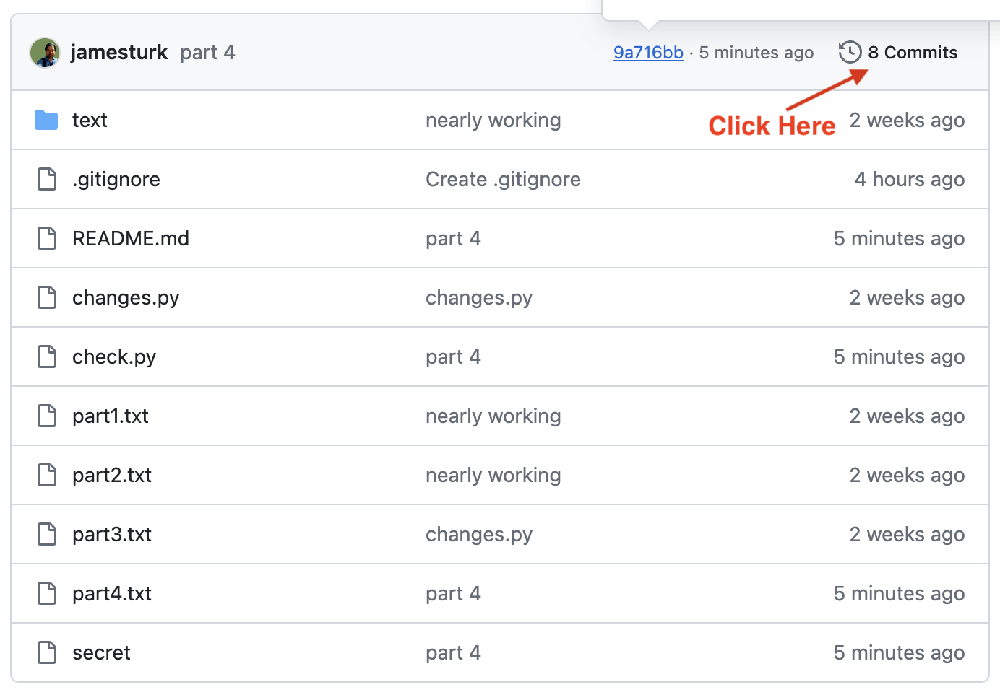

# CAPP Camp Git Lab

Like yesterday's lab, today's lab will ask you to take some steps with git and run a `check.py` script as you go.

As in yesterday's lab, this file is written in markdown.  You can view
the formatted document in VS Code using a keyboard shortcut: on macOS
use `Command-k v` and on WSL use `Ctrl-K v`.

## Part 1 - Making a First Commit

Whenever you have made a change that you wish to keep, you'll make a git commit.

Open up `part1.txt` using `code` and answer the questions.

When you've done so, add a commit with the message "part 1 done!"

Run `uv run python check.py 1` to check that your commit exists and is correct.

## Part 2 - Making & Reverting Changes with `git restore`

Open up the file `part2.txt` and make the modifications it describes. (Do not commit them yet!)

Run the command `uv run python check.py 2` which will verify that these changes are made.

Once you've run this command, undo the changes using git restore and run `uv run python check.py 2` again.

## Part 3 - Viewing Changes with `git diff`

Run the command `uv run python changes.py` this will make some changes to your local files, but will not commit them. (Do not commit them either!)

Then take a look at these changes with `git diff`, open up `part3.txt` and answer the questions based on the changes you see.

Be sure to commit your changes! Run the command `uv run python check.py 3` to verify that you have committed your changes.

## Part 4 -- Push your changes to GitHub

Have a look at your repository on GitHub.  Open a browser window to: `https://github.com/uchicago-capp-camp-2025/git-lab-GITHUB_USERNAME`, where `GITHUB_USERNAME` is replaced by **your** GitHub username.  Do you see your changes?  No!  Why?

Now use the `git status` command to verify that all your changes have been committed.  

We'll use the the git push command to transfer or "push" a commit made on a local branch on your computer to the corresponding branch of a remote repository.

The syntax for this command is: `git push <remote_repo_name> <remote_repo_branch_name>`.
By default, remote repositories are given the name "origin", which we saw when we ran `git remote -v`. The new default branch is "main".  So the full command would be: `git push origin main`.  Run this command now.

If your push succeeded, your changes should now be visible on GitHub.

Run the command `uv run python check.py 4` to verify that you have pushed your changes.

## Part 5 - Finding a Change in the `git log`

The answer to part 5 is in the git history. Use `git log` to find the necessary information.

You'll see that each commit has a value, known as a hash, like 'de8e74bc2c3ec106554440021efd1ec6808486c2'.
These values uniquely identify each commit.

These hash vaues can be used with `git show <hash-id>` to see what changed in a given commit or with `git diff <hash-id> <another hash-id>` to see the differences between two commits.

**Tip:** If you are typing hashes instead of copying & pasting, you can type the first 4-5 characters instead of the entire thing.

Use `git log` to discover the hash for the commit labeled "part 1 done" and add the full text of this hash to `part5.txt`. You may use `uv run python check.py 5` to confirm.

You can also try this using the GitHub interface which offers an alternative interface to view the log:

## Part 6 -- Push your changes from Part 5 to GitHub

Create a commit for the changes you made in Part 5 and push it to GitHub. 

Hint: you used `git push origin main` to push your first commit to GitHub.  You can use `git push` for subsequent pushes of this repository.

Now use the `git status` command to verify that all your changes have been committed and pushed.  If the result of this command does not show any changes to be committed or untracked files and includes the line `Your branch is up to date with 'origin/main'.`, then you are all set!
